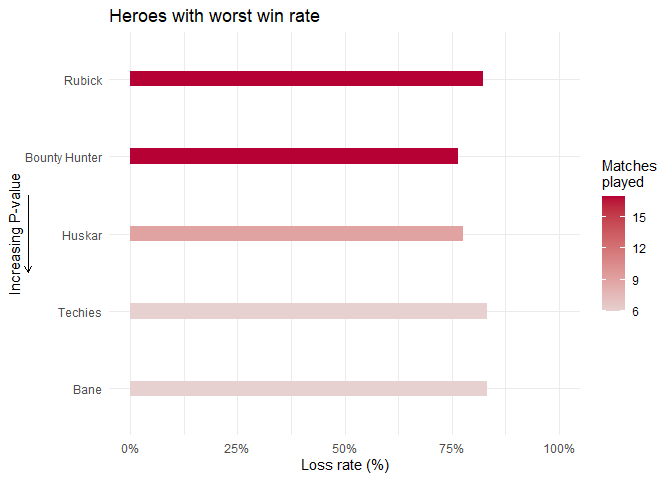

Dota Match Analysis
================

## Introduction

Dota 2 is a multiplayer online battle arena (MOBA) video game by Valve
Corporation. Two teams of five players compete against each other, with
the goal of destroying the opponent team’s Ancient, a guarded structure
located within their bases. Each player controls a unique hero, which
has distinct abilities and roles.

My own matches will be analysed in this project, with the main goal of
understanding what factors improve my odds of winning. Most of the data
is retrieved from the [OpenDota API](https://docs.opendota.com/). Extra
data on hero attributes is scraped from a Dota 2 Wikipedia page
[Liquipedia](https://liquipedia.net/dota2/Hero_Roles).

## Loading Data and Dependencies

``` r
# Loading libraries
library(tidyverse)
library(reshape2)
library(tibbletime)
library(scales)
library(stargazer)
library(glmnet)
library(caret)
library(randomForest)
library(yardstick)

# Set theme
theme_set(theme_minimal())

# Importing data
file.path <-"****"
hero <- read.csv(paste0(file.path, "dotahero.csv"), header = TRUE)
heroroles <- read.csv(paste0(file.path, "dotaheroroles.csv"), header = TRUE)
matches <- read.csv(paste0(file.path, "dotamatches.csv"), header = TRUE)
matchesinfo <- read.csv(paste0(file.path, "dotamatchesinfo.csv"), header = TRUE)
```

After loading all dependencies and all data, a small bit of cleanup
still has to be done.

Explanation of data frames imported:

- **hero**: Information on all heroes taken from OpenDota API

- **heroroles**: Hero attributes scraped from a Dota 2 Wikipedia page

- **matches**: Information on all matches I played taken from OpenDota
  API

- **matchesinfo**: IDs of all heroes on my team for all my matches taken
  from separate OpenDota API request

## Data Cleanup

``` r
# Reordering
heroroles <- select(heroroles, 1,5,2,3,4,c(6:11))

# Finding missing heroes
print(hero$localized_name[!hero$localized_name %in% heroroles$Hero])
```

    ## [1] "Hoodwink"     "Void Spirit"  "Dawnbreaker"  "Marci"        "Primal Beast"
    ## [6] "Muerta"

``` r
# Appending missing heroes
heroroles <- data.frame(Hero = c("Hoodwink", "Void Spirit", "Dawnbreaker", "Marci", "Primal Beast", "Muerta"),
Complexity = c(2, 2, 1, 2, 1, 1), Nuker = c(2, 2, 0, 0, 0, 2), 
Escape = c(2, 3, 0, 1, 0, 0), Carry = c(0, 2, 1, 1, 0, 3), 
Initiator = c(0, 0, 0, 2, 3, 0), Disabler = c(1, 1, 0, 1, 2, 1),
Durable = c(0, 0, 2, 0, 3, 0), Support = c(2, 0, 0, 1, 0, 0),
Pusher = c(0, 0, 0, 0, 0, 0), Jungler = c(0, 0, 0, 0, 0, 0)) %>%
rbind(heroroles, .)
```

The scraped heroroles data is not as updated as the hero attributes
taken from OpenDota API. Six heroes are not present, thus their
attributes are appended based on Dota 2’s official website.

<!-- -->

``` r
print(heroroles$Hero[which(heroroles$role.sum == 0)])
```

    ## [1] "Snapfire"

Hero attributes will be assessed to predict win rates. As such, heroes
with more roles attributed to them will be weighted higher. A histogram
of the sum of each heros’ role attributes (excluding complexity) is
plotted.

A relatively wide distribution is seen, thus normalisation can be
considered to ensure equal weighting.

One value is 0, suggesting an error on the website.

``` r
# Appending Snapfire's attributes
heroroles <- heroroles[-which(heroroles$Hero == "Snapfire"),]
heroroles <- rbind(heroroles, list("Snapfire", 1, 0, 3, 1, 0, 1, 0, 1, 0, 0, 6))

# Changing Melee to binary
hero$Melee <- ifelse(hero$attack_type == "Melee", 1,0)
# Merging both tables
hero <- merge(hero, heroroles, by.x = "localized_name", by.y = "Hero")
# Removing unnecessary columns, renaming hero name
hero <- hero[, c(-3,-5,-17)] %>% rename(name = localized_name)
```

The last faulty value is fixed. The Melee column is converted to binary
since only melee and ranged are possible. Both tables are merged, with
unnecessary columns removed.

    ##                 name  id primary_attr Melee Complexity Carry Nuker Escape
    ## 1            Abaddon 102          all     1          1     1     0      0
    ## 2          Alchemist  73          str     1          1     2     1      0
    ## 3 Ancient Apparition  68          int     0          2     0     1      0
    ## 4          Anti-Mage   1          agi     1          1     3     1      3
    ## 5         Arc Warden 113          agi     0          3     3     1      3
    ## 6                Axe   2          str     1          1     0     0      0
    ##   Initiator Disabler Durable Support Pusher Jungler
    ## 1         0        0       2       2      0       0
    ## 2         1        1       2       1      0       0
    ## 3         0        1       0       2      0       0
    ## 4         0        0       0       0      0       0
    ## 5         0        0       0       0      0       0
    ## 6         3        2       3       0      0       2

Explanation of variables in hero data:

- **name**: Name of the hero

- **id**: ID of the hero based on the OpenDota API

- **primary_attr**: An attribute that is either strength, intelligence
  or agility, which is hard to interpret without Dota knowledge

- **Melee**: 1 if the hero attacks with melee, and 0 if it is ranged

A higher number for the following attributes relates to a higher
intensity:

- **Complexity**: Difficulty in playing a hero

- **Carry**: A hero that is weak at the start but scales and is
  strongest at the end

- **Nuker**: A hero that deals high amounts of burst damage in one go

- **Escape**: A hero that can escape getting killed

- **Initiator**: A hero that cripples many enemies to start a team fight

- **Disabler**: A hero that incapacitates enemies

- **Durable**: A hero that can survive high amounts of damage

- **Support**: A hero that supports allies, typically the carry, and is
  less dependent on gold and items

- **Pusher**: A hero that deals high amounts of damage to towers and
  structures

- **Jungler**: A hero that can kill neutral creeps in the “Jungle”
  between lanes

``` r
# Merging both matches tables
matches <- merge(matches, matchesinfo, by = "match_id")
# Removing unnecessary columns, renaming hero ID
matches <- matches[, c(-1, -3, -4, -6, -7, -10, -14, -15, -16, -17)] %>% rename(ownheroID = hero_id)

# Converting to date and time
matches <- matches %>% mutate(start_time = as.POSIXct(start_time, origin = "1970-01-01 08:00:00")) %>% 
# Adding decimal hour
  mutate(start_hour = hour(start_time) + minute(start_time)/60 + second(start_time)/3600)
# Converting duration to minutes
matches$duration = matches$duration/60

head(matches)
```

    ##   win duration ownheroID          start_time kills deaths assists heroID1
    ## 1   1 35.48333        90 2014-04-18 13:24:44     0      7       2      23
    ## 2   1 31.78333        87 2014-05-03 18:34:42     3      4       8      13
    ## 3   1 32.66667        87 2014-05-03 20:20:09     2      8       3       6
    ## 4   0 48.56667        23 2014-05-04 13:53:27     3     12       6      77
    ## 5   0 51.01667        18 2014-05-04 16:16:57     4     11       7      84
    ## 6   0 38.90000         4 2014-05-04 21:52:25     3     19       5       4
    ##   heroID2 heroID3 heroID4 heroID5 start_hour
    ## 1      90      20      50      56   13.41222
    ## 2       6      87      74      32   18.57833
    ## 3     101      17      93      87   20.33583
    ## 4      19      32      23       7   13.89083
    ## 5      32     109      19      18   16.28250
    ## 6      15      49      53      14   21.87361

The match information is retrieved from two types of API calls. They are
first merged with unnecessary columns removed.

Time is given in UNIX time, thus it is converted to the right timezone
in date and time. Decimal hours are also created for subsequent
analysis. Duration is converted from seconds to minutes.

Explanation of variables in matches data:

- **win**: 1 if the match was won, and 0 if lost

- **duration**: Duration of the match in minutes

- **ownheroID**: ID of the hero I played

- **start_time**: Date and time when the match started

- **kills**: Number of enemy heroes I killed

- **deaths**: Number of times killed, mostly by enemy heroes

- **assists**: Number of times assisting a teammate in killing an enemy
  hero

- **heroID1 to heroID5**: IDs of all heroes in my team

- **start_hour**: Decimal hour when match started

## Data Exploration

<!-- -->

The average kills and assists are higher while deaths are lower for
wins. This is logical since kills and assists allow a player to get
ahead in experience and gold, while deaths result in the opposite.

<!-- -->

The duration of a match follows a roughly normal distribution, with the
mean at 43 minutes. The win rates for extreme durations are disregarded
since they are heavily skewed. My win rate appears to be the best at
around 20 minutes, suggesting that I may be good at closing matches off
in the “early game” phase, gradually performing worse as the matches
drag out.

<!-- -->

Matches were often played in the evening. Interestingly, dinner breaks
are also captured, as seen from the dip at 8 pm. There does not seem to
be any clear trend in when I perform best. Apart from the anomalies at 2
and 8 am caused by small sample size, win rate fluctuates and hovers
right above 50%, suggesting not a strong effect of time played on
performance.

<!-- -->

The majority of my matches were played from 2014 to 2015, where the
rolling win rate often stayed above the 50% mark. Much fewer matches
were played between 2016 and 2020, with the win rate dropping
dramatically, likely due to a lack of consistent gaming.

``` r
herowinrates <- matches %>% group_by(ownheroID) %>% 
# Grouping by win rate, wins, matches by hero 
  summarise(win_rate = sum(win)/n(), win = sum(win), matches = n()) %>% 
# Adding hero name
  merge(., hero[,c(1,2)], by.x = "ownheroID", by.y = "id") %>% 
# Adding p-value  
  mutate(p.value = apply(., MARGIN = 1, function(i){
    binom.test(as.integer(i[3]), as.integer(i[4]), 0.5, alternative = "two.sided")$p.value})) %>% 
  .[order(.$p.value),]
```

Since the matches played and win rate per hero varies greatly, a
two-tailed binomial test is conducted for each hero to account for both
variables. P-values for an alternative hypothesis of a win rate not
equal to 50% are obtained.

<!-- --><!-- -->

Based on p-values, the top three heroes I should choose to win are
Necrophos, Queen of Pain and Ember spirit since they have the highest
probabilities of having a more than average win rate. On the other hand,
I should not choose Rubick, Bounty Hunter and Huskar.

``` r
matches <- merge(matches, hero, by.x = "ownheroID", by.y = "id")
```

Each hero has a specific list of attributes. These can be matched back
to the matches I played to generate more variables. These can then be
analysed with a correlation matrix.

<!-- -->

A blue colour represents a higher positive correlation between the two
corresponding variables. Red represents the opposite.

The original match data is at the bottom-left corner. Kills and assists
are the most positively correlated with wins while deaths are negatively
correlated, in line with the analysis above. The duration of the match
has little correlation with the win rate.

The additional attributes of heroes I played are represented on the
top-right side. For example, the Initiator and Disabler attributes are
fairly strongly correlated, which makes sense when considering heroes
that can initiate team fights normally do so by “disabling” the
opponent.

Other interesting correlations include the slight positive correlation
between Carry and win, suggesting that I may have a higher chance at
winning if I pick a hero with a high Carry attribute.

## Predicting Match Outcomes

``` r
# First loops through the hero attributes
matchesbyroles <- sapply(hero[,c(4:14)], function(i){
# Next, loops through each of the five hero IDs in matches for the attribute
  sapply(matches[,c(8:12)], function(n){
# Matches the IDs with the relevant attributes
    i[match(n, hero$id)]}) %>% 
# Sums the relevant attributes
    rowSums()}) %>% 
  as.data.frame() %>% cbind(win = matches$win, .) %>% 
# Converting binary wins to text
  mutate(win = ifelse(win == 1, "Win", "Loss") %>% 
# Converting wins to factor type
           as.factor(.))
```

A good set of hero picks in a team is important in deciding who wins. It
is thus useful to see whether my team’s hero picks can be used to
predict wins and losses. The hero attributes are matched for each hero
in the team, and summed as a gauge of the team composition.

<!-- -->

Since the summed hero attributes are discrete variables with a small
range, a mean plot is made with a +/- one standard deviation range. The
difference in magnitude between each variable is not very significant,
considering the summed hero attributes for each attribute is not equal.
For example, each hero needs to have at least a complexity of one, which
is not a requirement for other values. This results in complexity having
the highest magnitude.

Comparing the hero attribute composition between winning and losing
matches, little differences are seen apart from the deviation in
Complexity, Initiator and Escape. A higher value for these attributes
might result in a higher chance of losing, but a multiple logistic
regression model is more useful in accurately analysing this.

``` r
set.seed(1)

# Setting 10-fold cross-validation
train_control <- trainControl(method = "cv", number = 10)

# Conducting logistic regression
roles.model <- train(win ~ ., data = matchesbyroles, method = "glm", family = binomial, trControl = train_control)
```

<table style="text-align:center">
<tr>
<td colspan="2" style="border-bottom: 1px solid black">
</td>
</tr>
<tr>
<td style="text-align:left">
</td>
<td>
Hero roles logistic regression model
</td>
</tr>
<tr>
<td>
</td>
<td colspan="1" style="border-bottom: 1px solid black">
</td>
</tr>
<tr>
<td style="text-align:left">
</td>
<td>
Increase in probability of win
</td>
</tr>
<tr>
<td colspan="2" style="border-bottom: 1px solid black">
</td>
</tr>
<tr>
<td style="text-align:left">
Melee
</td>
<td>
0.009 (0.068)
</td>
</tr>
<tr>
<td style="text-align:left">
Complexity
</td>
<td>
-0.182<sup>***</sup> (0.047)
</td>
</tr>
<tr>
<td style="text-align:left">
Carry
</td>
<td>
-0.012 (0.037)
</td>
</tr>
<tr>
<td style="text-align:left">
Nuker
</td>
<td>
-0.003 (0.032)
</td>
</tr>
<tr>
<td style="text-align:left">
Escape
</td>
<td>
-0.018 (0.031)
</td>
</tr>
<tr>
<td style="text-align:left">
Initiator
</td>
<td>
-0.044 (0.039)
</td>
</tr>
<tr>
<td style="text-align:left">
Disabler
</td>
<td>
-0.012 (0.043)
</td>
</tr>
<tr>
<td style="text-align:left">
Durable
</td>
<td>
0.017 (0.035)
</td>
</tr>
<tr>
<td style="text-align:left">
Support
</td>
<td>
-0.012 (0.037)
</td>
</tr>
<tr>
<td style="text-align:left">
Pusher
</td>
<td>
0.013 (0.034)
</td>
</tr>
<tr>
<td style="text-align:left">
Jungler
</td>
<td>
-0.046 (0.050)
</td>
</tr>
<tr>
<td style="text-align:left">
Constant
</td>
<td>
1.975<sup>***</sup> (0.615)
</td>
</tr>
<tr>
<td colspan="2" style="border-bottom: 1px solid black">
</td>
</tr>
<tr>
<td style="text-align:left">
Accuracy
</td>
<td>
0.548
</td>
</tr>
<tr>
<td style="text-align:left">
Kappa
</td>
<td>
0.0525
</td>
</tr>
<tr>
<td style="text-align:left">
Observations
</td>
<td>
1,337
</td>
</tr>
<tr>
<td colspan="2" style="border-bottom: 1px solid black">
</td>
</tr>
<tr>
<td style="text-align:left">
<em>Note:</em>
</td>
<td style="text-align:right">
<sup>*</sup>p<0.1; <sup>**</sup>p<0.05; <sup>***</sup>p<0.01
</td>
</tr>
</table>

The multiple logistic regression model with 10-fold cross validation
suggests that only the complexity attribute is useful in predicting the
win rate. A higher complexity attributes suggests that a team picked
heroes that were difficult to play with, resulting in a lower chance of
winning if incompetent. The other factors were rather insignificant in
predicting the win rate.

The accuracy of the model, the probability that the model is able to
predict the right winning outcome, is rather low. Perhaps another model
is more useful in predictions.

``` r
# First loops through each hero ID
matchesbyheroes <- lapply(hero$id, function(i){
# Next, loops through each of the five heroes for each match checking for the hero ID
  apply(ifelse(matches[,c(8:12)] == i,1,0), MARGIN = 1, sum)}) %>% 
  as.data.frame() %>%
# Adding back hero names, but replacing space and - with _ and removing '
  setNames(gsub(" ","_",gsub("-","_",gsub("'","",hero$name)))) %>% 
# Removing heroes that do not appear in any matches
  .[,-c(which(colMeans(.) == 0))] %>% 
  cbind(win = matches$win, .) %>%
# Relabels win variable to string
  mutate(win = ifelse(win == 1, "Win", "Loss") %>%
# Converting wins to factor type
                        as.factor(.))
```

Instead of trying to predict wins by the attributes of heroes played,
the heroes played themselves can be used for prediction. There is one
column for each hero, stating whether the hero was picked for each
match, along with whether the match was a win or loss.

``` r
set.seed(1)

# Retrieving original glm model info
glm_wo_intercept <- getModelInfo("glm",regex=FALSE)[[1]]
glm_wo_intercept$fit <- function (x, y, wts, param, lev, last, classProbs, ...) 
{
    dat <- if (is.data.frame(x)) 
        x
    else as.data.frame(x, stringsAsFactors = TRUE)
    dat$.outcome <- y
    if (length(levels(y)) > 2) 
        stop("glm models can only use 2-class outcomes")
    theDots <- list(...)
    if (!any(names(theDots) == "family")) {
        theDots$family <- if (is.factor(y)) 
            binomial()
        else gaussian()
    }
    if (!is.null(wts)) 
        theDots$weights <- wts
# modelArgs is changed from outcome ~ . to outcome ~ 0+., which essentially removes the intercept
    modelArgs <- c(list(formula = as.formula(".outcome ~ 0+."), 
        data = dat), theDots)
    out <- do.call("glm", modelArgs)
    out$call <- NULL
    out
}

# Conducting logistic regression, with 10-fold cross validation
heroes.model <- train(win ~ ., data = matchesbyheroes, method = glm_wo_intercept, family = binomial, trControl = train_control)
```

The intercept of the model is removed since the data set suffers from
the dummy variable trap (the last hero in a match can always be
determined since every match has exactly five heroes).

<table style="text-align:center">
<tr>
<td colspan="2" style="border-bottom: 1px solid black">
</td>
</tr>
<tr>
<td style="text-align:left">
</td>
<td>
Heroes logistic regression model
</td>
</tr>
<tr>
<td>
</td>
<td colspan="1" style="border-bottom: 1px solid black">
</td>
</tr>
<tr>
<td style="text-align:left">
</td>
<td>
Increase in probability of win
</td>
</tr>
<tr>
<td colspan="2" style="border-bottom: 1px solid black">
</td>
</tr>
<tr>
<td style="text-align:left">
Omniknight
</td>
<td>
1.408<sup>***</sup> (0.374)
</td>
</tr>
<tr>
<td style="text-align:left">
Necrophos
</td>
<td>
1.186<sup>***</sup> (0.315)
</td>
</tr>
<tr>
<td style="text-align:left">
Enchantress
</td>
<td>
-1.323<sup>***</sup> (0.457)
</td>
</tr>
<tr>
<td style="text-align:left">
Clinkz
</td>
<td>
1.039<sup>***</sup> (0.369)
</td>
</tr>
<tr>
<td style="text-align:left">
Ursa
</td>
<td>
0.839<sup>***</sup> (0.304)
</td>
</tr>
<tr>
<td style="text-align:left">
Rubick
</td>
<td>
-0.692<sup>***</sup> (0.256)
</td>
</tr>
<tr>
<td style="text-align:left">
Wraith_King
</td>
<td>
0.826<sup>***</sup> (0.312)
</td>
</tr>
<tr>
<td style="text-align:left">
Io
</td>
<td>
-1.164<sup>**</sup> (0.456)
</td>
</tr>
<tr>
<td style="text-align:left">
Lich
</td>
<td>
0.871<sup>**</sup> (0.355)
</td>
</tr>
<tr>
<td style="text-align:left">
Nyx_Assassin
</td>
<td>
-0.686<sup>**</sup> (0.289)
</td>
</tr>
<tr>
<td style="text-align:left">
Drow_Ranger
</td>
<td>
0.526<sup>**</sup> (0.222)
</td>
</tr>
<tr>
<td style="text-align:left">
Tusk
</td>
<td>
0.699<sup>**</sup> (0.298)
</td>
</tr>
<tr>
<td style="text-align:left">
Lifestealer
</td>
<td>
-0.683<sup>**</sup> (0.297)
</td>
</tr>
<tr>
<td style="text-align:left">
Lina
</td>
<td>
0.642<sup>**</sup> (0.293)
</td>
</tr>
<tr>
<td style="text-align:left">
Bounty_Hunter
</td>
<td>
-0.554<sup>**</sup> (0.264)
</td>
</tr>
<tr>
<td style="text-align:left">
Axe
</td>
<td>
0.527<sup>**</sup> (0.259)
</td>
</tr>
<tr>
<td style="text-align:left">
Zeus
</td>
<td>
0.449<sup>*</sup> (0.230)
</td>
</tr>
<tr>
<td style="text-align:left">
Puck
</td>
<td>
-0.599<sup>*</sup> (0.308)
</td>
</tr>
<tr>
<td style="text-align:left">
Shadow_Fiend
</td>
<td>
-0.419<sup>*</sup> (0.216)
</td>
</tr>
<tr>
<td style="text-align:left">
Alchemist
</td>
<td>
-0.550<sup>*</sup> (0.289)
</td>
</tr>
<tr>
<td colspan="2" style="border-bottom: 1px solid black">
</td>
</tr>
<tr>
<td style="text-align:left">
Accuracy
</td>
<td>
0.553
</td>
</tr>
<tr>
<td style="text-align:left">
Kappa
</td>
<td>
0.0895
</td>
</tr>
<tr>
<td style="text-align:left">
Observations
</td>
<td>
1,337
</td>
</tr>
<tr>
<td colspan="2" style="border-bottom: 1px solid black">
</td>
</tr>
<tr>
<td style="text-align:left">
<em>Note:</em>
</td>
<td style="text-align:right">
<sup>*</sup>p<0.1; <sup>**</sup>p<0.05; <sup>***</sup>p<0.01
</td>
</tr>
</table>

For the sake of brevity, only the most important heroes for the model
are shown. Unfortunately, the accuracy of this model is also not
significantly better than when using hero role attributes as variables.

``` r
set.seed(1)

# Running random forest classification
heroes.forest <- randomForest(win ~ ., data = matchesbyheroes)
```

<!-- -->

The accuracy using a Random Forest classification is slightly better
than with logistic regression. Looking at the confusion matrix, the
model is better at correctly predicting wins than losses.

## Conclusion

Analysis of my matches already reveals some interesting insights on how
I perform in my games. Statistics on the hero attributes also serve as a
rough gauge of how a normal Dota 2 match at my matchmaking rating is
like on a broader scale. However, predicting matches based on the hero
picks of my team is still a challenge looking at the low level of
accuracy from the classification models. Some factors that contribute to
the low accuracy could be the small data set and simplicity of models.
Nonetheless, the data set had sufficient samples and variables for
trends and patterns to be extracted as a Exploratory Data Analysis (EDA)
project.
